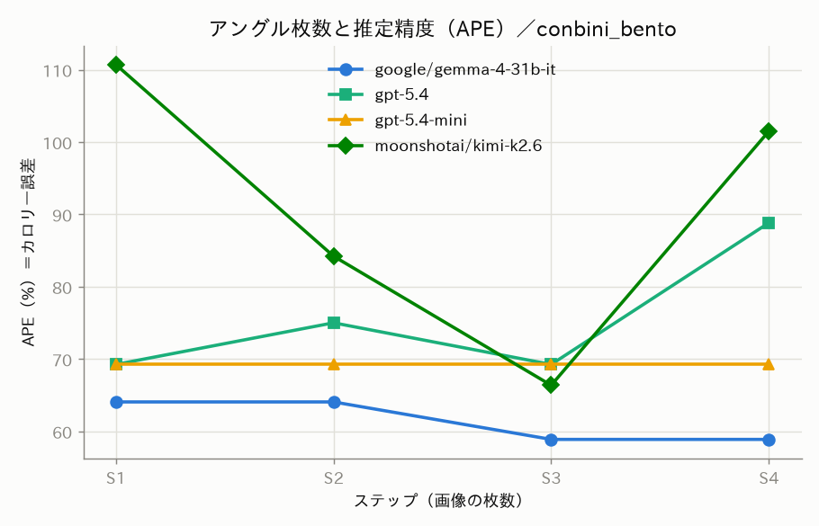
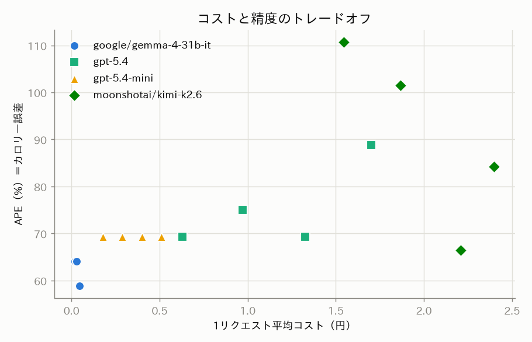

<!--
記事① テーマ本体（カロリー推定モデル比較）ドラフト
対応課題: CAL-12 / 数値・図は全て 30_development/data/results（ログ由来・手打ちなし）
確認日: 2026-07-08。投稿は人間承認（未投稿）。
-->

# 牛丼とコンビニ弁当のカロリーをAIに当てさせたら？ 最新GPT vs 国内DCの激安オープンモデルを費用と精度でガチ比較

## 1. 掴み — 写真1枚でカロリーは当たるのか

「この料理、何キロカロリー？」——写真を見せるだけでAIが答えてくれたら便利です。本記事では、
**すき家の牛丼**と**コンビニのそぼろ弁当**の2品を題材に、料理写真からカロリー（と料理名・PFC）を
推定させ、**OpenAIの最新GPT**と、**国内データセンター（ai& Inference）で動く激安オープンモデル**を、
**費用**と**精度**の両面で比較しました（オープンモデル自体は海外製。国内なのは推論を行うデータセンターです）。

結論を先に言うと、意外な絵が出ました。

- **牛丼は全モデルがほぼ的中**（誤差1〜8%）。ところが**そぼろ弁当は全モデルが大きく外す**（誤差59〜111%）。
- つまり「AIはカロリーを当てられるか？」の答えは**料理による**。しかも**モデルの優劣まで料理でひっくり返る**。
- そして、**1コールの実コストが本家GPTの数十分の一**（入力トークン単価では十数分の一）の激安オープンモデルが、弁当では**最も正確**でした。

> ⚠️ **注意**: 本結果はモデルの精度比較が目的で、実際の栄養・健康管理に用いるものではありません。
> カロリーは推定値です。サンプルは**今回の2品のみ**で、一般化はできません。

## 2. 手軽さ — `base_url` を1行差し替えるだけ

ai& Inference は **OpenAI 互換API**です。つまり OpenAI 向けに書いたコードの `base_url` を
差し替えるだけで、そのまま国内DCのオープンモデルに投げられます。比較コードが1本化できます。

```python
from openai import OpenAI

# OpenAI 本家
client = OpenAI(api_key=OPENAI_KEY)
# ai& Inference（base_url を差し替えるだけ・キー以外そのまま）
client = OpenAI(api_key=AIAND_KEY, base_url="https://api.aiand.com/v1")

resp = client.chat.completions.create(
    model=model_id,
    messages=[{"role": "user", "content": [
        {"type": "text", "text": prompt},
        {"type": "image_url", "image_url": {"url": data_uri}},  # 画像を data URI で添付
    ]}],
    temperature=0,
)
```

出力は毎回同じ**固定JSONスキーマ**（`dish_name, total_kcal, protein_g, fat_g, carb_g, confidence`）で
受け取り、パースして集計します。全リクエストの usage・レイテンシ・生応答は JSONL に1行ずつ記録し、
**記事の数値・グラフはすべてこのログから機械生成**しています（手打ちゼロ）。

## 3. 実験設定

| 項目 | 内容 |
|------|------|
| 料理 | ①コンビニ そぼろ弁当（正解 **579 kcal**・パッケージ栄養成分表示より・単一商品の参考値・確認日2026-07-08）②すき家 牛丼並盛（正解 **695 kcal**・[すき家公式 栄養成分一覧](https://images.zensho.co.jp/materials/sukiya/allergen/nutrition.pdf)・更新日2026-07-03） |
| モデル | OpenAI: **gpt-5.4** / **gpt-5.4-mini**、ai&: **gemma-4-31b-it** / **kimi-k2.6**（いずれもvision対応・料金は実APIと公式で確認、2026-07-08） |
| 条件 | 写真のみ・`temperature=0`・各条件**3試行**（ブレも記録） |
| アングル積み増し | 弁当は同じ料理を4角度で撮り 1枚ずつ足す（S1=1枚〜S4=4枚）。牛丼は入手できた第三者提供の単一画像のため S1 のみ |
| 指標 | **APE**（絶対%誤差 `|推定−正解|/正解×100`）・料理名正解率・レイテンシ・実コスト |

料金の出典と確認日、モデルIDはすべて実API（`/models`）と公式ページで確定しています（推測は排除）。

## 4. 結果① — 「アングルを増やすと精度は上がる」のか？

本実験の主役は「**写真の角度を積み増すと精度はどこで頭打ちになるか**」でした。弁当で1枚ずつ足した
結果が下図です。



予想に反し、**角度を足しても精度はほとんど上がりません**でした（弁当・APE%）。

| モデル | S1 | S2 | S3 | S4 | 傾向 |
|--------|---:|---:|---:|---:|------|
| gemma-4-31b-it | 64.1 | 64.1 | 58.9 | 58.9 | わずかに改善（最良） |
| gpt-5.4-mini | 69.3 | 69.3 | 69.3 | 69.3 | **完全にフラット**（角度を使っていない） |
| gpt-5.4 | 69.3 | 75.0 | 69.3 | 88.8 | むしろ S4 で悪化 |
| kimi-k2.6 | 110.7 | 84.2 | 66.4 | 101.5 | 大きくブレる |

単調に改善したのは gemma だけ。gpt-5.4-mini は4段階すべて同じ推定値で、追加した角度を実質無視。
**少なくともこの弁当では、アングルの積み増しは精度に効かず、コスト（入力トークン）だけが増えました。**

## 5. 結果② — モデル別ランキングは「料理で逆転」する

同じ4モデルで、2品それぞれの平均APEと料理名正解率を並べます。

**そぼろ弁当（正解 579 kcal）**

| 順位 | モデル | 平均APE | 料理名正解率 |
|:--:|--------|-------:|-----:|
| 1 | gemma-4-31b-it | **61.5%** | 100% |
| 2 | gpt-5.4-mini | 69.3% | 100% |
| 3 | gpt-5.4 | 75.6% | 100% |
| 4 | kimi-k2.6 | 90.7% | 83% |

**すき家 牛丼（正解 695 kcal・S1のみ）**

| 順位 | モデル | 平均APE | 料理名正解率 |
|:--:|--------|-------:|-----:|
| 1 | kimi-k2.6 | **1.2%** | 100% |
| 2 | gpt-5.4 | 3.6% | 100% |
| 2 | gpt-5.4-mini | 3.6% | 100% |
| 4 | gemma-4-31b-it | 7.9% | 100% |

2つの表を見比べると、**弁当で最下位だった kimi が牛丼では最良**、**弁当で最良だった gemma が牛丼では最下位**。
順位が丸ごとひっくり返っています。「どのモデルが一番か」は料理によって変わり、**万能に最良のモデルは
今回の2品では見当たりませんでした**。

もう一点。**料理名はほぼ全モデルが正解**（弁当を「弁当／そぼろ弁当」、牛丼を「牛丼」と認識）。
つまりモデルは**何の料理かは分かっているのに、弁当のカロリーだけ大きく外す**。
「料理を認識できること」と「カロリーを当てられること」は別物でした。

## 6. 結果③ — 「1日1万リクエスト」で費用を逆算

1リクエストの実コスト（usage × 各モデル単価、USD建てを為替でJPY換算）を、
「毎日1万人が1回ずつ撮影するアプリ」に逆算します（弁当S1・1日あたり）。

| モデル | 1コール | 1日1万リクエスト |
|--------|-------:|-----------:|
| gemma-4-31b-it | ¥0.021 | **約¥207** |
| gpt-5.4-mini | ¥0.179 | 約¥1,786 |
| gpt-5.4 | ¥0.629 | 約¥6,293 |
| kimi-k2.6 | ¥1.545 | 約¥15,450 |

**gemma は gpt-5.4 の約1/30、kimi の約1/75のコスト**。しかも弁当では gemma が精度も最良でした。
一方 kimi は「入力単価は安い」にもかかわらず、回答前に大量の推論トークンを消費するため、
**1コールが最も高く（¥1.5前後）・最も遅い（約10〜17秒）**という結果に。**per-token 単価の安さと、
実際の1コールあたりコストは一致しない**という良い教訓です。



コスト×精度の散布図では、**下の集団（すき家・低APE）と上の集団（弁当・高APE）にくっきり分離**します。
同じモデルでも料理でAPEが激変することが一目で分かります。

## 7. 考察

- **最大の発見：過大評価は「モデルの癖」ではなく「料理固有」**。定番でシンプルな牛丼は全モデルが
  ほぼ的中。一方、そぼろ＋コロッケ＋フライ＋ハンバーグと具材が多い弁当は全モデルが大幅に過大評価しました。
  精度を決めるのは**料理の複雑さ・定番度**であって、モデルの高い/安いではなさそうです（今回の2品では）。
- **アングルの費用対効果**：少なくともこの弁当では、角度の積み増しは精度に効かず、入力コストだけ増えました。
  「多角度を撮って渡す」より「1枚で十分」という示唆です（要・追試）。
- **激安オープンモデルの健闘**：gemma は弁当で最良精度＋最安。「安い＝劣る」は今回は成り立ちませんでした。
- **国内データセンター × オープンモデルという選択肢**：食事写真は体型・健康と結びつく個人データです。
  海外クラウドに送りたくないニーズに対し、**国内DCで完結する激安オープンモデル**が実用精度を出せるなら、
  クローズドな海外APIでは満たせない要件（データの国内完結）に応えられます。

## 8. 締め

写真1枚でAIにカロリーを当てさせる試みは、「当たる料理と当たらない料理がはっきり分かれる」
「モデルの優劣は料理で逆転する」「国内DCで動く激安オープンモデルが本家GPTに精度で勝つ場面がある」という、
教科書的でない結果を見せてくれました。

健康データを扱うアプリを**国内DCのオープンモデル**で、しかも**桁違いに安く**組める——今回の2品は、
その選択肢が現実的であることを示す小さな証拠になりました。

---

### 再現情報

- コード・プロンプト・条件・実験ログは本リポジトリ（`30_development/`）。図表は `calorielens score` /
  `calorielens visualize` でログから再生成。
- モデル料金・vision対応・seed対応は実API（`/models`）と公式ページで確認（2026-07-08）。
- 正解kcal 出典: 弁当＝パッケージ栄養成分表示、牛丼＝すき家（ゼンショー）公式栄養成分一覧。

> ⚠️ **再掲**: 本結果はモデル精度比較が目的で、実際の栄養・健康管理には用いません。カロリーは推定値、
> サンプルは今回の2品のみです。牛丼は写真1枚（S1のみ）での比較で、アングル積み増しは弁当のみです。
